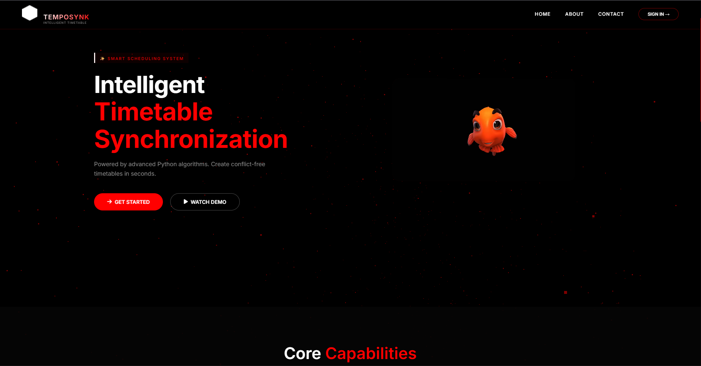
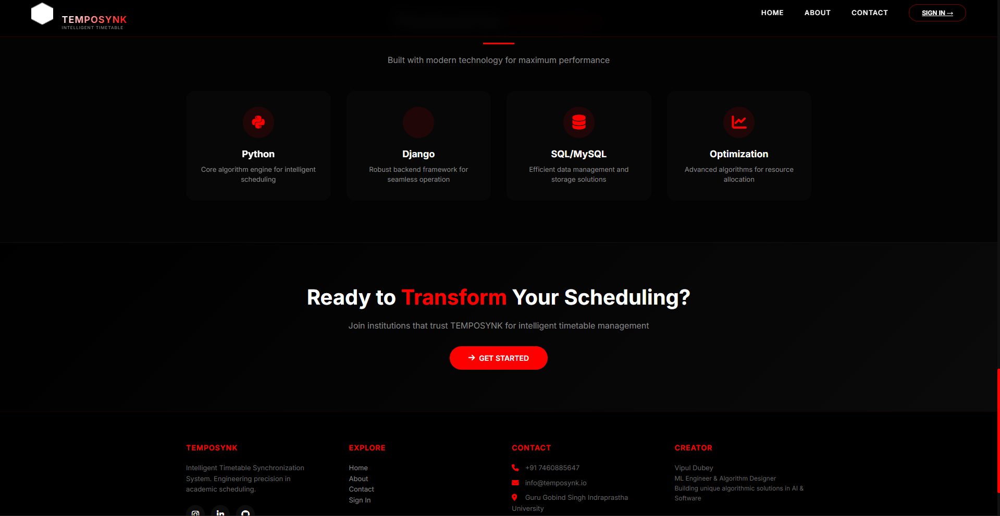
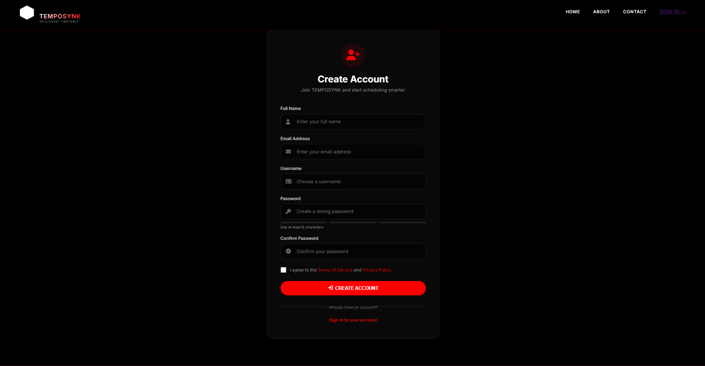
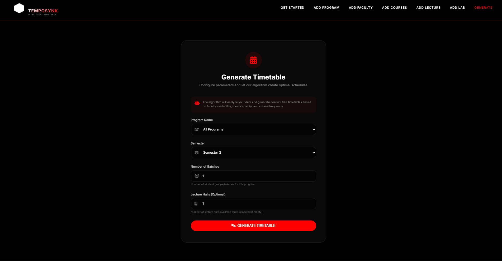
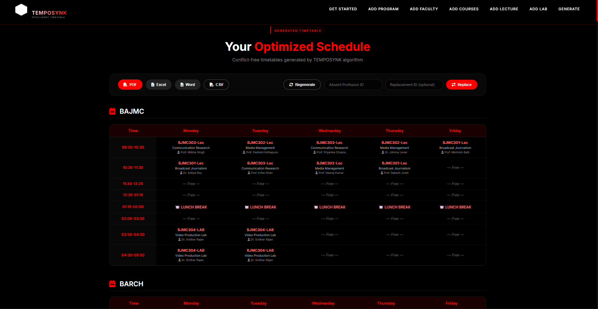

# 🕒 TEMPOSYNK - Intelligent Timetable Synchronization System

[](https://python.org)
[](https://djangoproject.com)
[](https://sqlite.org)
[](LICENSE)

> **Automated academic scheduling system that generates conflict-free timetables using intelligent algorithms**

## 📌 Overview

TEMPOSYNK is a comprehensive timetable management system designed for educational institutions. It eliminates manual scheduling headaches by automatically generating optimized timetables that respect all constraints including faculty availability, room capacity, course frequency, and workload distribution.
## 📸 Screenshots & Demo Video

### 🎥 Demo Video
Watch the complete walkthrough of TEMPOSYNK in action:

[](https://github.com/HitanDubey/TEMPOSYNK-Intelligent-Timetable-Synchronization-System/blob/main/Demmo%20Video.mp4)

<details>
<summary>Click to view demo video link</summary>

**📹 Demo Video:** [Click here to watch/download](https://github.com/HitanDubey/TEMPOSYNK-Intelligent-Timetable-Synchronization-System/blob/main/Demmo%20Video.mp4)

</details>

### 🖼️ Screenshots

#### 🏠 Home Page
*Landing page with 3D background animation and system overview*



#### ℹ️ About Page
*System information, mission, vision, and technology stack*



#### 📝 Registration Page
*User sign-up with password strength validation*



#### 📊 Dashboard
*Admin dashboard with quick access to all features*


#### ⚙️ Timetable Generator
*Configuration page for generating timetables with program, semester, and batch selection*



#### 📅 Generated Timetable Output
*Conflict-free timetable display with faculty workload and lab utilization reports*



---
### ✨ Key Features

- **🤖 Intelligent Algorithm** - Python-powered engine that processes complex scheduling constraints
- **📊 Conflict-Free Scheduling** - Ensures no overlapping classes or resource conflicts
- **👥 Faculty Management** - Track workloads and handle replacements seamlessly
- **🏛️ Resource Optimization** - Maximize utilization of lecture halls and laboratories
- **📱 Multiple Export Formats** - Download timetables as PDF, Excel, Word, or CSV
- **📈 Comprehensive Reports** - Faculty workload and lab utilization analytics
- **🔧 Real-time Adjustments** - Professor replacement without regenerating entire timetable
- **🎨 Modern UI** - Dark-themed responsive interface with smooth animations

## 🚀 Quick Start

### Prerequisites

- Python 3.8 or higher
- pip package manager

### Installation

```bash
# Clone the repository
git clone https://github.com/HitanDubey/TEMPOSYNK.git
cd TEMPOSYNK

# Install dependencies
pip install -r requirements.txt
# go to the main directory where you run your local server
cd autotime
cd tt
# Initialize database with sample data
python insert_data.py

# Run migrations
python manage.py migrate

# Start the development server
python manage.py runserver